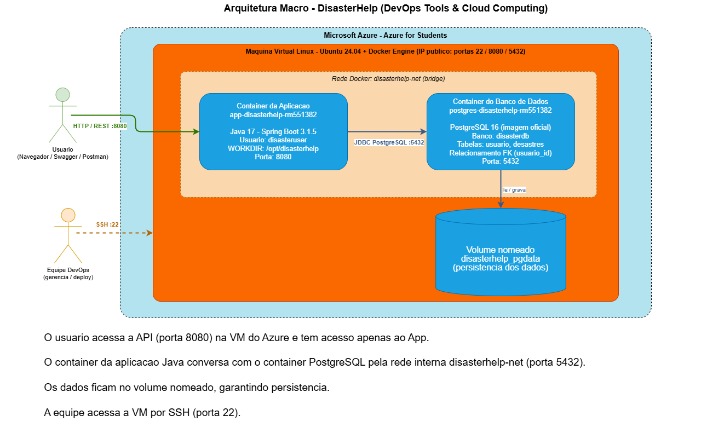

# DisasterHelp - DevOps Tools & Cloud Computing

API REST em Java (Spring Boot) para cadastro e gestao de eventos climaticos / desastres,
conteinerizada com Docker e executada em nuvem (VM no Azure) com dois containers integrados:
a aplicacao Java e o banco PostgreSQL.

RM do representante: 551382
Containers: `app-disasterhelp-rm551382` (aplicacao) e `postgres-disasterhelp-rm551382` (banco)

## Descricao da solucao

O DisasterHelp permite registrar usuarios e desastres naturais (enchentes, ondas de calor,
tempestades, etc.), informando tipo, descricao, regiao afetada e data prevista. A ideia e
centralizar informacoes de eventos climaticos para apoio a prevencao e resposta.

A solucao roda em dois containers Docker orquestrados por Docker Compose, na mesma rede
(`disasterhelp-net`):

- `app-disasterhelp-rm551382`: imagem personalizada (build multi-stage), API Java/Spring Boot na porta 8080.
- `postgres-disasterhelp-rm551382`: imagem oficial postgres:16, banco de dados na porta 5432.

Os dados sao gravados em duas tabelas no PostgreSQL:

- `usuario`: usuarios do sistema (usados na autenticacao).
- `desastres`: eventos climaticos cadastrados (CRUD completo).

A tabela `desastres` tem a coluna `usuario_id` como chave estrangeira para `usuario(id)`
(relacionamento N:1, indicando o usuario responsavel pelo registro do desastre). Ao cadastrar um
desastre, o sistema grava automaticamente o usuario autenticado (do token) como responsavel, e a
resposta da API traz os campos `usuarioId` e `responsavel`.

## Tecnologias

- Java 17 e Spring Boot 3.1.5 (Web, Data JPA, Security/JWT, Validation, Swagger)
- PostgreSQL 16
- Docker (build multi-stage) e Docker Compose
- Maven (build feito dentro do container)

## Arquitetura



Resumo do fluxo: o usuario acessa a API pela porta 8080 da VM no Azure. Dentro da VM, o Docker
executa o container da aplicacao e o container do banco, que se comunicam pela rede interna
`disasterhelp-net`. Os dados do banco ficam em um volume nomeado, mantendo a persistencia mesmo
que os containers sejam recriados.

## Como executar (do clone ate a nuvem)

Pre-requisito: uma VM Linux no Azure (Azure for Students) com as portas 22 (SSH), 8080 (app)
e 5432 (banco) liberadas no grupo de seguranca de rede.

### Conectar na VM do Azure

1. No seu computador, abrir o terminal (PowerShell no Windows) e conectar por SSH, usando o
   IP publico da VM:

   ```
   ssh azureuser@<IP_PUBLICO_DA_VM>
   ```

   Confirmar com `yes` na primeira vez e informar a senha do usuario.

2. Instalar Docker, Compose e Git na VM:

   ```
   sudo apt-get update
   sudo apt-get install -y docker.io docker-compose-v2 git
   sudo usermod -aG docker $USER
   ```

3. Sair e reconectar no SSH para a permissao do Docker valer, depois verificar:

   ```
   exit
   ssh azureuser@<IP_PUBLICO_DA_VM>
   docker --version && docker compose version
   ```

### Subir os containers

Clonar o repositorio e entrar na pasta:

```
git clone https://github.com/MikW02/GS-DevOps.git
```

```
cd GS-DevOps
```

Subir App + Banco em modo background (-d) e construindo a imagem:

```
docker compose up -d --build
```

Conferir os containers em execucao:

```
docker ps
```

### Ver os logs dos dois containers

Logs do container da aplicacao:

```
docker compose logs app
```

Logs do container do banco:

```
docker compose logs postgres-db
```

### Acessar o terminal dos containers (usuario e diretorio)

Container da aplicacao - usuario conectado (disasteruser, nao root), diretorio de trabalho e estrutura:

```
docker container exec app-disasterhelp-rm551382 whoami
docker container exec app-disasterhelp-rm551382 pwd
docker container exec app-disasterhelp-rm551382 ls -l
```

Container do banco - usuario conectado, diretorio atual e estrutura:

```
docker container exec postgres-disasterhelp-rm551382 whoami
docker container exec postgres-disasterhelp-rm551382 pwd
docker container exec postgres-disasterhelp-rm551382 ls -l
```

## Testar o CRUD

A API usa autenticacao JWT. Ja existe um usuario admin criado automaticamente:

- email: admin@disasterHelp.com
- senha: admin123

Documentacao interativa (Swagger): http://<IP_DA_VM>:8080/swagger-ui.html
Ao testar de fora da nuvem, trocar `localhost` pelo IP publico da VM.

Login (obter token):

```
TOKEN=$(curl -s -X POST http://localhost:8080/DisasterHelp/api/usuario/login \
  -H "Content-Type: application/json" \
  -d '{"email":"admin@disasterHelp.com","senha":"admin123"}' | grep -o '"token":"[^"]*"' | cut -d'"' -f4)
echo $TOKEN
```

Create:

```
curl -X POST http://localhost:8080/disasterHelp/api/desastre \
  -H "Authorization: Bearer $TOKEN" -H "Content-Type: application/json" \
  -d '{"tipo":"Deslizamento","descricao":"Encosta instavel apos chuvas","regiao":"Petropolis - RJ","dataPrevista":"2026-06-15"}'
```

Read (listar todos):

```
curl http://localhost:8080/disasterHelp/api/desastre -H "Authorization: Bearer $TOKEN"
```

Read (buscar por id):

```
curl http://localhost:8080/disasterHelp/api/desastre/1 -H "Authorization: Bearer $TOKEN"
```

Update:

```
curl -X PUT http://localhost:8080/disasterHelp/api/desastre/1 \
  -H "Authorization: Bearer $TOKEN" -H "Content-Type: application/json" \
  -d '{"tipo":"Enchente","descricao":"Nivel do rio subindo","regiao":"Sao Paulo - Zona Leste","dataPrevista":"2026-06-20"}'
```

Delete:

```
curl -X DELETE http://localhost:8080/disasterHelp/api/desastre/3 -H "Authorization: Bearer $TOKEN"
```

## Evidencia da persistencia no banco (SELECT)

Conectar direto no container do banco e rodar os SELECT apos cada operacao do CRUD:

```
docker container exec -it postgres-disasterhelp-rm551382 psql -U postgres -d disasterdb
```

No psql, listar as duas tabelas (usuario e desastres):

```
\dt
```

Mostrar a estrutura da tabela desastres (a coluna usuario_id e a FK para usuario):

```
\d desastres
```

Todos os dados da tabela de eventos climaticos (a coluna usuario_id mostra o relacionamento com o usuario):

```
SELECT * FROM desastres ORDER BY id;
```

Todos os dados da tabela de usuarios:

```
SELECT * FROM usuario ORDER BY id;
```

Para sair do psql:

```
\q
```

## Encerrar o ambiente

Parar e remover os containers (mantem o volume com os dados):

```
docker compose down
```

Parar e remover tambem o volume nomeado (apaga os dados do banco):

```
docker compose down -v
```

## Estrutura do repositorio

```
GS-DevOps/
  Dockerfile             # imagem da API (multi-stage, usuario nao root)
  docker-compose.yml     # app + postgres, rede e volume nomeado
  .dockerignore
  pom.xml                # dependencias Maven
  src/                   # codigo-fonte Java (Spring Boot)
  docs/                  # diagrama de arquitetura
```
